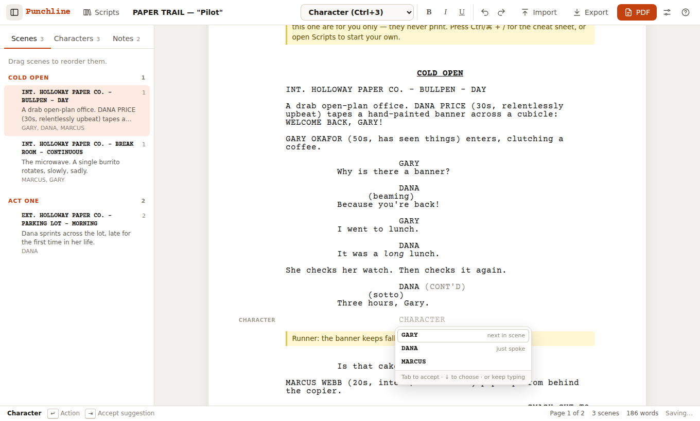

# Punchline

A screenwriting app for **single-camera sitcoms**, the half-hour format of *The Office*, *Parks and Recreation* and *Abbott Elementary*. It knows the format, so you just write. It remembers your characters and suggests who speaks next, and it lays out your pages the way a production would print them.



Punchline runs in the browser, works offline and needs no account. Your scripts are stored on your computer.

## What version 1 does

| | |
|---|---|
| **Script elements** | Scene Heading (slugline), Action, Character, Parenthetical, Dialogue, Transition, Shot (secondary slugline), New Act, End of Act, and **Notes** that never print |
| **Keyboard flow** | Enter and Tab move through elements the way Final Draft does: Character → Dialogue → Character… Tab in Dialogue adds a (parenthetical), even mid-speech |
| **Smart typing** | `int.` becomes a Scene Heading, `smash cut to:` a Transition, `(` in dialogue a Parenthetical, `[[` a Note, `ACT TWO` a New Act |
| **Character memory** | Every name you use is remembered, in this script and across your other scripts (recurring cast). On a new Character line Punchline predicts who talks next: in a conversation it's the other person. |
| **Autocomplete** | Scene headings in three steps (INT./EXT. → locations you've used → DAY / NIGHT / CONTINUOUS…), transitions, act names (it knows ACT TWO follows ACT ONE, and which "END OF …" you need), parentheticals, `(V.O.)` / `(O.S.)` extensions |
| **Scenes** | Navigator listing acts and scenes with page numbers, synopsis and cast. Click to jump, or drag to reorder a scene with everything in it. Optional scene numbers. |
| **Single-cam layout** | Industry margins, acts on new pages with centered bold-underlined headers, live page breaks in the editor, automatic `(CONT'D)`, `(MORE)` when a speech breaks across pages |
| **Files** | PDF export (Courier Prime, title page). Import and export **Fountain** and **Final Draft (.fdx)**. Copy and paste work as Fountain, so text moves cleanly to and from other apps. |
| **Library** | Any number of scripts, saved automatically in the browser. Duplicate, delete, back up as `.punchline` |

Press **Ctrl/⌘ + /** in the app for the cheat sheet, which covers every shortcut and the format rules.

## Run it

You need [Node.js](https://nodejs.org) 20 or newer.

```bash
npm install
npm run dev        # open http://localhost:5173
```

The first launch opens a short sample pilot that uses every element. Start your own from **Scripts → New Single-Cam Sitcom**.

To build a static site you can host anywhere, run `npm run build`; the output goes to `dist/`. `npm run build:single` produces a single self-contained `dist-single/index.html` that you can open straight from disk. `npm run build:demo` builds the same file for an online preview where the host blocks downloads; exporting is switched off there and explains why.

To put it online with GitHub Pages, go to **Settings → Pages**, set **Source** to **GitHub Actions**, then run the **Deploy to GitHub Pages** workflow from the Actions tab.

### Where your work is saved

Scripts are saved automatically to the browser's IndexedDB, on your machine only. Clearing site data deletes them, so use **Export → Punchline backup** (or Fountain / Final Draft) to keep copies. If the browser won't allow storage (some private windows), the status bar says so.

## Keyboard

| Key | In… | Does |
|---|---|---|
| Enter | any element | next element (Scene Heading → Action, Character → Dialogue, Dialogue → Character, Transition → Scene Heading, New Act → Scene Heading…) |
| Enter | an empty element | switches it: empty Character → Action, empty Action → Scene Heading |
| Tab | empty Action | Character (then Transition → Scene Heading) |
| Tab | Dialogue | adds a Parenthetical, splitting the line if you're mid-speech |
| Tab | autocomplete open | accepts the highlighted suggestion |
| Alt/⌥ + 1…9, 0 | anywhere | Scene Heading, Action, Character, Parenthetical, Dialogue, Transition, Shot, New Act, End of Act, Note (Ctrl/⌘ + number also works where the browser doesn't reserve it for switching tabs) |
| Ctrl/⌘ + B / I / U | text | bold, italic, underline |
| Shift + Enter | text | line break inside an element |
| Ctrl/⌘ + P | anywhere | PDF preview |

## Development

```bash
npm test           # unit tests (Vitest) for the format engine, pagination, import/export
npm run test:e2e   # browser tests (Playwright + Chromium)
npm run typecheck
```

The code is split so that format knowledge is not tied to the UI:

```
src/core/            framework-free TypeScript, fully unit tested
  formats/           script format definitions (margins, flow, vocabulary)
  layout/            word wrap and pagination
  io/                Fountain, Final Draft, PDF
  analysis.ts        scenes, characters, notes, (CONT'D)
  suggestions.ts     autocomplete and character memory
  flow.ts            Enter / Tab behaviour and smart typing
  scenes.ts          scene moves
src/editor/          ProseMirror editor, including plugins for autocomplete, page breaks and smart typing
src/ui/              React app shell: navigator, dialogs, file handling
src/storage/         local script library (IndexedDB)
```

A script format is data. [`src/core/formats/singleCamSitcom.ts`](src/core/formats/singleCamSitcom.ts) defines every element's indent, width, capitalisation, spacing, page rules, Enter/Tab flow and autocomplete vocabulary. The editor's CSS, the paginator and the PDF writer all read it, which is how version 2 adds formats without touching the editor.

See [docs/single-cam-format.md](docs/single-cam-format.md) for the format reference and [docs/ROADMAP.md](docs/ROADMAP.md) for version 2.

## Credits

The editor is set in [Courier Prime](https://quoteunquoteapps.com/courierprime/) (SIL Open Font License, see `src/assets/fonts/OFL.txt`). Fountain is an open screenplay format: [fountain.io](https://fountain.io).
